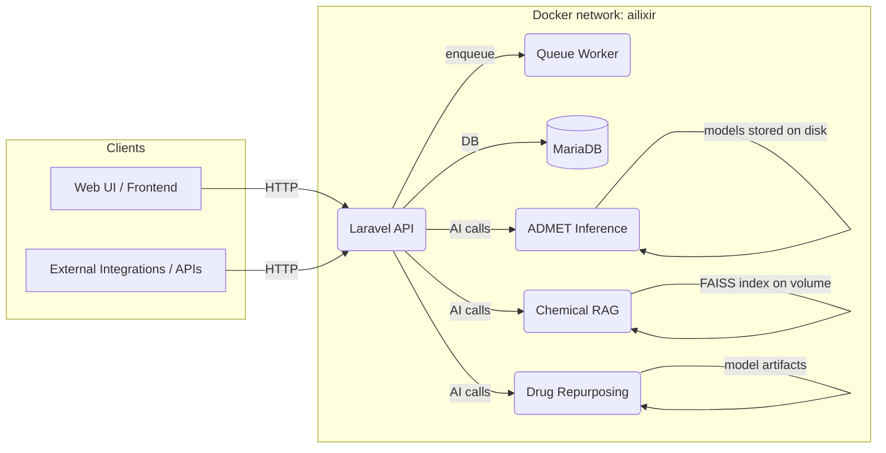
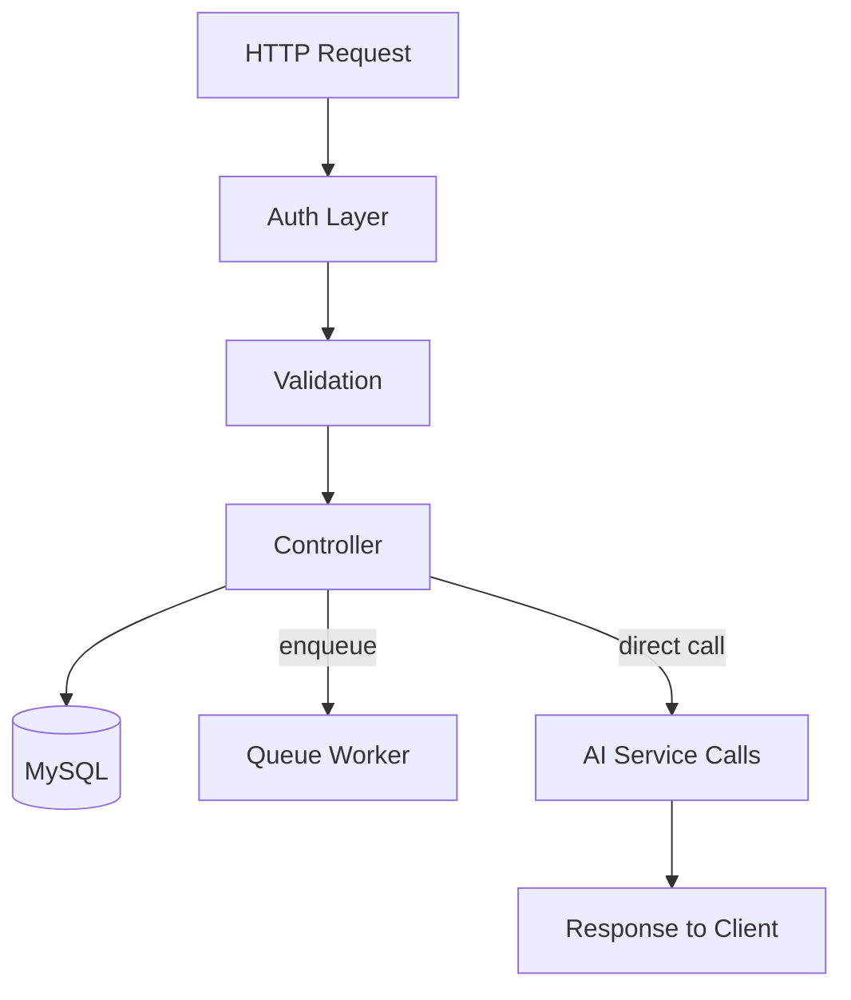

# AILIXIR Architecture & Component Documentation

Last updated: 2026-05-29

This document provides detailed diagrams and per-component explanations for the AILIXIR BackEnd. It is intended for developers and SREs onboarding onto the project and for inclusion in production runbooks.

Contents
--------
- System-level architecture (diagram + explanation)
- Data flow and request lifecycle
- Per-service component diagrams and responsibilities
  - Laravel (orchestration)
  - ADMET inference (FastAPI)
  - Drug Repurposing (FastAPI)
  - Chemical RAG (FAISS + RAG)
- Environment variables & configuration locations
- Deployment notes and scaling considerations
- Troubleshooting checkpoints

System-level architecture (Mermaid)
----------------------------------



Explanation
-----------

- Clients (web, CLI, external services) interact with the `laravel` orchestration API. The Laravel layer handles authentication, request validation, and orchestration of multi-step workflows.
- Long-running tasks are delegated to the `queue` worker via Laravel's queue system. The queue worker communicates with the same Laravel codebase and uses the internal database for job bookkeeping.
- AI microservices are independent FastAPI services: `admet`, `drug-repurposing`, and `chemical-rag`. Laravel calls these services over the internal Docker network by service name.
- Persistent storage: `mysql` holds application state, users, and job metadata; AI services use container volumes for model artifacts and FAISS indexes.

Request lifecycle — typical screening flow
---------------------------------------

1. Client POSTs request to Laravel endpoint (e.g., run screening).
2. Laravel validates and creates a job record in MySQL and either performs synchronous work or enqueues a background job.
3. Background job triggers calls to AI services in parallel or sequence depending on pipeline stage:
   - `drug-repurposing` to run virtual screening
   - `admet` to score ADMET properties
   - `chemical-rag` to fetch similar compounds or augment results
4. AI services return raw predictions to Laravel which aggregates results, persists summary, and notifies the client.

Per-service diagrams & responsibilities
--------------------------------------

1) Laravel (orchestration)



Responsibilities:

- Authentication and authorization (API tokens, OAuth, or guards configured in `config/auth.php`).
- Centralized error handling and logging.
- Exposes REST endpoints used by UI and third-party clients; routes live under `routes/`.
- Job dispatching and scheduling; queue worker executes heavy pipelines.

Where to look in repository:

- `app/Http/Controllers/` — controllers and endpoints
- `routes/api.php` — API routes and versioning
- `jobs/` and `app/Jobs` — background job implementations
- `docker/laravel.env` — example env values

2) ADMET inference (FastAPI)

```mermaid
flowchart TD
  Req[POST /predict]
  Validate[SMILES Validation (RDKit)]
  Feat[Featurization / Graph builder]
  Models[MPNN Models (5 tasks)]
  Aggregate[Aggregate predictions]
  Return[JSON response]

  Req --> Validate --> Feat --> Models --> Aggregate --> Return
```

Responsibilities:

- Load pre-trained MPNN models on startup (check `models/` inside service).
- Validate SMILES strings with RDKit and sanitize input.
- Support single and batch prediction endpoints; expose `/health` and `/docs`.
- CPU-optimized inference (no GPU assumed by default) and async handling via Uvicorn.

Where to look:

- `ai_apps/ADMIT/admet_inference/` — service code, `README.md`, `Dockerfile`, `requirements.txt`.
- Health and docs endpoints available at `http://<host>:<port>/health` and `/docs`.

3) Drug Repurposing (FastAPI)

```mermaid
flowchart TD
  Req[POST /api/v1/screen]
  Targets[OpenTargets integration]
  Sequences[UniProt fetch]
  Drugs[Drug library (TDC / fallback)]
  Model[DeepPurpose MPNN-CNN]
  Results[Rank & postprocess]
  Return[JSON summary]

  Req --> Targets --> Sequences --> Drugs --> Model --> Results --> Return
```

Responsibilities:

- Full screening pipeline: disease→targets→proteins→screening→results.
- Integrates external APIs (OpenTargets, UniProt) and TDC for drug libraries.
- Provides mock modes for offline testing (use env `USE_MOCK_MODEL` and `USE_MOCK_DRUGS`).

Where to look:

- `ai_apps/Drug Reporposing/` — service implementation, `docker/` folder, `requirements.txt`, `README.md` and helper scripts (`start.sh`, `start.bat`).

4) Chemical RAG (FAISS + LLM)

```mermaid
flowchart TD
  Req[/search/full-rag]
  Validate[SMILES validation]
  FP[Morgan fingerprint / embedding]
  FAISS[FAISS-IVF index lookup]
  LLM[LLM explanation (optional)]
  Format[Result formatting]
  Return[JSON results]

  Req --> Validate --> FP --> FAISS --> LLM --> Format --> Return
```

Responsibilities:

- High-performance similarity search for large compound libraries (1M+).
- Persistent FAISS index stored on volume (`chemical-rag-data`).
- Two endpoints: retrieval-only and full RAG (with LLM explanations); auto-detects and ingests compounds on first run.

Where to look:

- `ai_apps/chemical-rag-system/chemical-rag-system/` — engine, ingestion scripts, FAISS index code, `run_server.py`, and `README.md`.

Environment variables & configuration locations
---------------------------------------------

- Root compose: `docker-compose.yml` — service names, build contexts, ports, and env files.
- Laravel env template: `docker/laravel.env` — application and DB defaults.
- Each AI service: check `ai_apps/<service>/` for `requirements.txt`, `Dockerfile`, and service-specific config (e.g., `app/config.py`).

Production deployment notes
-------------------------

- Resource limits: `docker-compose.yml` contains `deploy.resources.limits` for AI services; tune these for production (memory, CPU).
- Secrets: move sensitive env values into secret managers (Kubernetes Secrets, Vault) in production.
- HTTPS: terminate TLS at a reverse proxy in front of `laravel` (Nginx/Load Balancer) and restrict internal-only exposure for AI services.

Scaling considerations
---------------------

- Horizontal scaling of AI services: deploy multiple replicas behind a load balancer. Ensure models are loaded on container start and center model size is within available RAM.
- FAISS index: store on a shared volume or use a dedicated retrieval service with replicated indices.
- Database: use managed RDS/MariaDB clusters or replicas for HA.

Troubleshooting checkpoints
--------------------------

- Service not healthy: `docker compose logs -f <service>` and `docker compose ps` to check ports and status.
- Model load errors: inspect service logs, confirm model files under `models/` or configured model path.
- FAISS ingestion slow: watch `chemical-rag` logs on first-run ingestion; ensure sufficient CPU and disk I/O.

Appendix — quick visual references
---------------------------------

- Root system diagram: see top of this file (Mermaid block).
- Per-service diagrams: each service section above contains its own Mermaid block.

Next steps I can implement for you
----------------------------------

1. Generate PNG/SVG exports of these Mermaid diagrams and add them to the repo docs folder.
2. Standardize and replace `ai_apps/*/README.md` with a consistent template including: purpose, architecture diagram, setup (Docker + local), env vars, run commands, API endpoints, troubleshooting.
3. Create `docs/` folder and add `QUICK_START.md`, per-service `.env.example`, and the generated diagrams.

Tell me which of the next steps you'd like me to do now (1, 2, 3), or if you want all of them performed.
