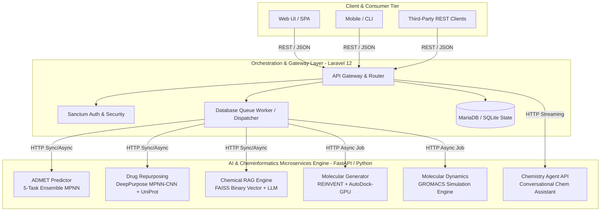
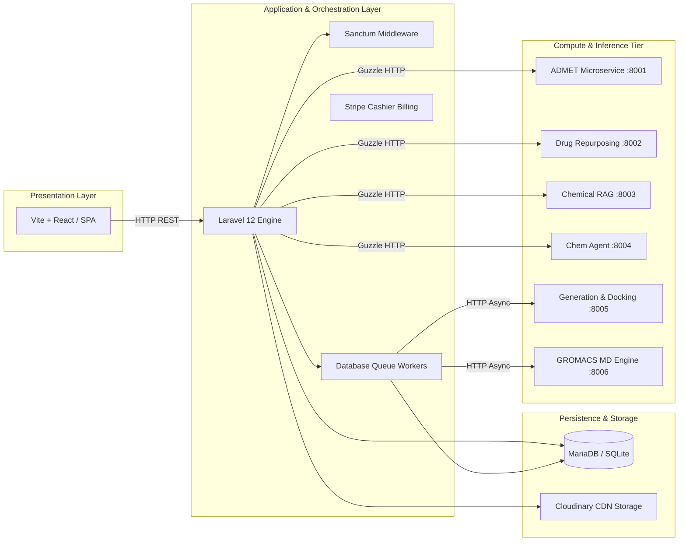
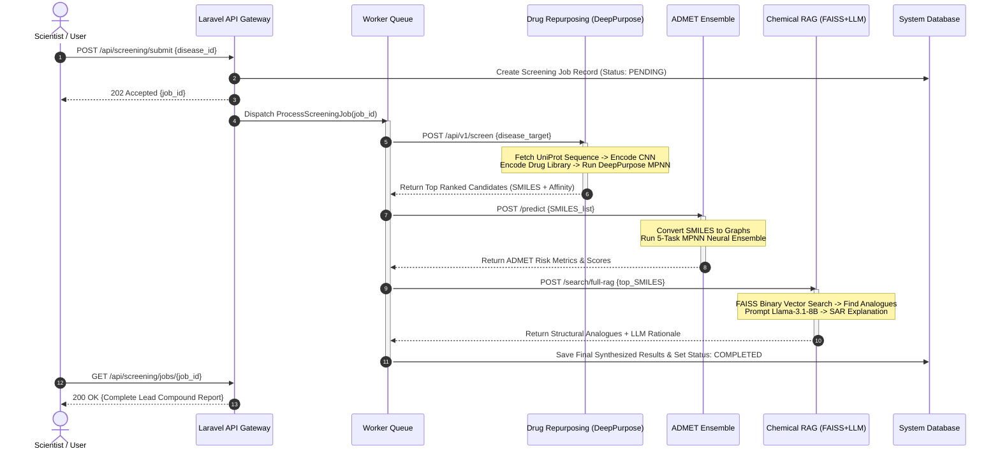
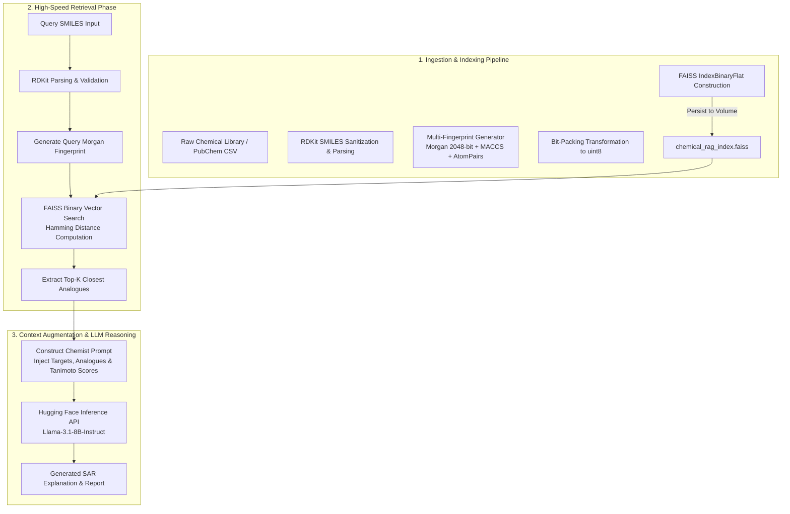
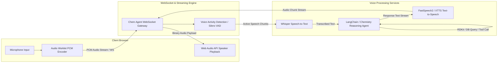
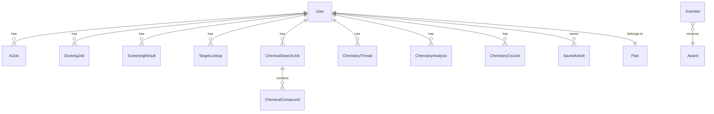

# AILIXIR — Enterprise AI-Powered Drug Discovery & Chemistry Intelligence Platform

<div align="center">


**Accelerating molecular generation, virtual screening, ADMET profiling, and structure-activity reasoning through microservice AI orchestration.**

[](https://www.php.net/)
[](https://laravel.com/)
[](https://www.python.org/)
[](https://fastapi.tiangolo.com/)
[](https://pytorch.org/)
[](https://www.rdkit.org/)
[](https://www.docker.com/)
[](LICENSE)

---

[Key Features](#5-key-features) • [System Architecture](#6-system-architecture) • [AI Pipeline](#7-ai-pipeline) • [RAG Engine](#8-rag-pipeline) • [Installation](#13-installation-guide) • [API Docs](#16-api-documentation) • [Engineering Challenges](#17-engineering-challenges)

</div>

---

## 1. Hero Section

**AILIXIR** is an enterprise-grade AI drug discovery platform that bridges deep learning microservices with robust web orchestration. It integrates de novo molecule generation, target-based drug repurposing, multi-property ADMET profiling, high-dimensional chemical vector search, and molecular dynamics simulation into a unified API ecosystem.

> 🛠️ **Demo Video / UI Sandbox**: *[Placeholder: Add link to video demonstration or interactive frontend sandbox]*  
> 📷 **Architecture Overview Graphic**: *[Placeholder: Insert high-resolution system diagram graphic]*

---

## 2. The Problem

### The Real-World Challenge in Early-Stage Drug Discovery

Developing a novel therapeutic molecule is one of the most expensive and time-consuming endeavors in modern science:
- **Timeline**: 10 to 15 years from target discovery to approval.
- **Cost**: Exceeds **$2.6 billion USD** per approved drug (including failed pipeline costs).
- **Failure Rate**: **>90%** of candidate molecules fail in clinical trials due to efficacy shortfalls or unexpected absorption, distribution, metabolism, excretion, and toxicity (ADMET) profile failures.

```
+-----------------------------------------------------------------------------------+
| TRADITIONAL DRUG DISCOVERY PIPELINE                                               |
|                                                                                   |
|  Target Identification   Compound Synthesis    In Vitro/Vivo ADMET    Clinical Trial |
|  [ 1 - 2 Years ] ------> [ 2 - 3 Years ] -----> [ 2 - 3 Years ] ----> [ 6+ Years ]|
|                          (High Friction)        (90% Failure Rate)    ($2.6B Total)|
+-----------------------------------------------------------------------------------+
```

### Key Pain Points
1. **Hyper-Dimensional Chemical Space**: Chemical space contains an estimated $10^{60}$ synthetically feasible drug-like molecules. Traditional high-throughput screening (HTS) screens only $10^6$ compounds (<0.0000000000000000000000000000000000000000000000000001% of space).
2. **Siloed Computational Tools**: Cheminformatics software, docking engines, deep learning property predictors, and molecular dynamics suites exist in fragmented command-line packages with incompatible data structures.
3. **Late-Stage ADMET Failures**: ADMET testing traditionally occurs late in candidate optimization, wasting millions on molecules that fail simple bioavailability or cytotoxicity filters.
4. **Lack of Explainability**: Black-box neural network predictions are routinely dismissed by medicinal chemists who require structural rationale for predictions.

---

## 3. Why Existing Solutions Are Not Enough

Traditional computational chemistry and early commercial platforms suffer from critical structural limitations:

| Dimension | Traditional Software / Scripting | Generic AI Wrappers | AILIXIR Platform |
|---|---|---|---|
| **Architectural Topology** | Monolithic local scripts (CLI heavy) | Monolithic API wrapper over 1 model | Microservice-orchestrated multi-model engine |
| **Pipeline Integration** | Manual file transfers (SDF, PDB, CSV) | REST endpoints for single task | Unified job queue with asynchronous callbacks |
| **ADMET Assessment** | Rule-of-five heuristics (Lipinski) | Single-property predictions | 5-task MPNN multi-target neural ensemble |
| **Search Scale & Speed** | CPU linear scanning ($O(N)$ execution) | Exact string SQL querying | FAISS binary vector indexing ($O(1)$ Hamming) |
| **Domain Explainability** | None (Raw numerical float outputs) | Generic non-domain LLM prompts | Domain-tuned RAG combining chemical topology |
| **Compute Elasticity** | Static single machine compute | Fixed cloud instances | Containerized async queues with GPU scaling |

### Technical Limitations of Prior Approaches
- **Rule-Based Heuristics**: Lipinski's Rule of 5 fails to account for active transport, modern macrocycles, or complex structural binding nuances.
- **Linear Similarity Scans**: Querying a 1,000,000+ molecule database using exact Tanimoto/Dice comparisons on unindexed CPU threads requires minutes per query.
- **Isolated Docking**: Running molecular docking independently without immediate ADMET feedback creates candidates with high binding affinity but toxic metabolic profiles.

---

## 4. Our Solution

AILIXIR bridges computational chemistry and modern software engineering by establishing a multi-layered, microservice-orchestrated API platform.



### Key Architectural Concepts
1. **Decoupled Gateway & Computation**: High-performance PHP 8.3/Laravel 12 handles user session state, payments, authentication, and job queuing, allowing Python microservices to focus exclusively on tensor computation and GPU inference.
2. **Unified Representation Standard**: All molecular structures are validated, standardized, and canonicalized using RDKit across all service boundaries using SMILES (Simplified Molecular Input Line Entry System) and PDB QT formats.
3. **Hybrid Synchronous & Asynchronous Execution**: Low-latency tasks (ADMET scoring, chemical search) resolve synchronously in `<300ms`, while compute-heavy jobs (molecular dynamics, docking, generation) dispatch to asynchronous background queues with polling endpoints.

---

## 5. Key Features

```
+---------------------------------------------------------------------------------------+
|                                    AILIXIR FEATURES                                   |
+--------------------------+--------------------------+---------------------------------+
| 🧬 AI & Deep Learning    | 🔬 Virtual Screening     | 🔍 RAG Vector Search            |
| - De novo REINVENT gen   | - DeepPurpose MPNN-CNN   | - FAISS binary indexing         |
| - 5-Task ADMET Ensemble  | - Target API integration | - Multi-fingerprint fusion      |
| - AutoDock-GPU scoring   | - UniProt sequence fetch | - Llama-3.1-8B explanations     |
+--------------------------+--------------------------+---------------------------------+
| 🤖 Chemistry AI Agent    | 🧪 Molecular Dynamics    | 💳 Platform Architecture        |
| - Conversational Chemist | - GROMACS simulation     | - Stripe tiered billing         |
| - CSV batch processing   | - Trajectory analytics   | - Cloudinary file management    |
| - SMILES verification    | - RMSD/RMSF extraction   | - Supervisor & Docker isolated  |
+--------------------------+--------------------------+---------------------------------+
```

### Feature Categories & Technical Breakdown

#### 1. Artificial Intelligence & Generative Chemistry
- **De Novo Molecule Generation**: Reinforcement-learning-driven molecular generator using REINVENT architecture, scored dynamically against custom protein targets via AutoDock-GPU.
- **Multi-Task ADMET Prediction**: Neural Message Passing Neural Network (MPNN) predicting 5 vital ADMET parameters (Human Intestinal Absorption, Blood-Brain Barrier Penetration, CYP450 Inhibition, Clearance, Toxicity).

#### 2. Virtual Screening & Drug Repurposing
- **Automated Target Integration**: Direct integration with OpenTargets and UniProt APIs to automatically extract target proteins, amino acid sequences, and disease association scores.
- **DeepPurpose Screening**: Deep learning drug-target interaction (DTI) predictions employing MPNN encoders for molecules and CNN encoders for protein sequences.

#### 3. High-Dimensional Chemical Retrieval
- **FAISS Binary Vector Indexing**: High-speed chemical similarity search capable of processing over 1,000,000 molecules with sub-millisecond latency using 2048-bit fingerprints.
- **Multi-Fingerprint Structural Fusion**: Hybrid similarity metrics combining Morgan (Circular), MACCS Keys, Atom Pairs, and Topological Torsions.
- **LLM-Augmented RAG Rationale**: Retrieval-Augmented Generation using Llama-3.1-8B-Instruct to produce automated natural language structure-activity relationship (SAR) summaries.

#### 4. Physics Simulation & Chemistry Agent
- **GROMACS MD Pipeline**: Full workflow automation for preparing molecular systems, applying force fields, running energy minimization, NVT/NPT equilibration, and production MD trajectories.
- **Conversational Chemistry Agent**: AI assistant capable of interpreting chemical queries, validating SMILES strings, comparing molecular pairs, and processing multi-molecule CSV payloads.

---

## 6. System Architecture

AILIXIR uses an isolated multi-container architecture orchestrated via Docker Compose.

### Detailed Layer Breakdown



### Component Responsibilities

1. **Laravel Orchestration Core (`:8000`)**:
   - Manages routing, rate-limiting, user authentication (Sanctum), and subscription limits (Stripe).
   - Serves as the central API gateway; external clients never interact directly with raw Python AI microservices.
   - Manages job state tracking, persistent logs, and user activity history.

2. **ADMET Inference Microservice (`:8001`)**:
   - Built on FastAPI and PyTorch.
   - Loads pre-trained graph neural network weights into memory at startup.
   - Exposes `/predict` and `/predict-file` endpoints for single SMILES or bulk CSV processing.

3. **Drug Repurposing Microservice (`:8002`)**:
   - Communicates with OpenTargets GraphQL API and UniProt REST API.
   - Converts protein sequences into 1D CNN representations and SMILES into graph neural representations.
   - Generates binding affinity scores ($K_d$, $K_i$, or $IC_{50}$).

4. **Chemical RAG System (`:8003`)**:
   - Maintains persistent in-memory FAISS binary vector indices mapped to a disk volume.
   - Calculates binary Hamming distance between bit-packed fingerprints.
   - Calls Hugging Face Inference API (Llama-3.1-8B-Instruct) for context generation.

5. **Molecular Generation & Docking (`:8005`)**:
   - Executes AutoDock Vina / AutoDock-GPU binary instances.
   - Runs reinforcement learning optimization loops (REINVENT) to iterate SMILES toward binding affinity targets.

6. **Protein-Ligand MD Simulation (`:8006`)**:
   - Wraps GROMACS execution suites inside Docker containers.
   - Parses trajectory outputs (`.xtc`, `.trr`) into summary statistics (RMSD, RMSF, Hydrogen Bond counts).

---

## 7. AI Pipeline

The core decision pipeline translates qualitative disease inputs into scored, validated lead candidates through multi-stage neural reasoning.



---

## 8. RAG Pipeline

AILIXIR uses a domain-adapted Retrieval-Augmented Generation (RAG) architecture tailored for molecular structures rather than textual paragraphs.



### Deep Dive into RAG Steps

1. **Ingestion & Sanitization**:
   - SMILES strings are parsed via RDKit, removing salts, standardizing tautomers, and assigning canonical SMILES representations.
2. **Fingerprint Featurization**:
   - Converts canonical SMILES into 2048-bit Morgan Fingerprints (radius=2, equivalent to ECFP4) alongside 166-bit MACCS keys.
3. **Binary Vector Indexing**:
   - Standard floating-point vector similarity (Cosine/Euclidean) is computationally inefficient for 2048-bit bit vectors. AILIXIR packs bits into `uint8` byte arrays and uses `FAISS.IndexBinaryFlat` to compute exact Hamming distances directly in hardware registers.
4. **Context-Rich Prompt Engineering**:
   - Retrieved chemical analogues, structural similarity metrics (Tanimoto coefficients derived from Hamming distance via $T = \frac{C}{A + B - C}$), and predicted ADMET profiles are formatted into a domain-restricted prompt context.
5. **LLM Generation**:
   - Llama-3.1-8B-Instruct generates natural language commentary highlighting pharmacophores, potential metabolic liabilities, and bioisosteric substitution suggestions.

---

## 9. Voice Pipeline

AILIXIR incorporates a real-time conversational chemistry interface for hands-free laboratory usage.



### Voice Execution Sequence
1. **Audio Capture**: Browser streams low-latency raw PCM audio over WebSockets.
2. **VAD Filtering**: Silero Voice Activity Detection filters out ambient laboratory noise, forwarding audio only during detected speech intervals.
3. **STT Transcription**: OpenAI Whisper transcribes incoming chemical names and spoken instructions into text.
4. **Agent Tool Orchestration**: The Chemistry Agent parses intent, using RDKit to resolve spoken common names (e.g., "Aspirin") to canonical SMILES (`O=C(C)Oc1ccccc1C(=O)O`) and querying the internal ADMET engine.
5. **TTS Audio Synthesis**: The response streams back as binary audio via XTTS/FastSpeech2 and plays instantly through the browser's Web Audio API.

---

## 10. Validation Engine

To prevent hallucinatory AI predictions in chemical safety assessments, AILIXIR employs a deterministic, rule-based computational validation layer before deep learning inference.

```
                  +-----------------------------------+
                  |      Raw SMILES Input String      |
                  +-----------------------------------+
                                    |
                                    v
                  +-----------------------------------+
                  |      RDKit Molecule Parsing       |
                  +-----------------------------------+
                                    |
                 /                                     \
        (Valid SMILES)                           (Invalid SMILES)
               |                                         |
               v                                         v
+-----------------------------+           +-----------------------------+
| Deterministic Validation    |           | Immediate Error Signal      |
| - Valence & Charge Checking |           | - HTTP 422 Unprocessable    |
| - Salt Strip & Canonicalize |           | - Exact Structural Error Msg|
| - Bredt's Rule & Ring Strain|           +-----------------------------+
+-----------------------------+
               |
               v
+-----------------------------+
| Deep Learning Model Infer   |
| - MPNN ADMET Prediction     |
| - DeepPurpose DTI Scoring   |
+-----------------------------+
               |
               v
+-----------------------------+
| Confidence Verification     |
| - Epistemic Variance Check  |
| - Out-of-Domain Detection   |
+-----------------------------+
```

### Deterministic Checks & Verification Rules

1. **Chemical Valence & Sanity Verification**:
   - Uses RDKit's explicit valence checking. Hypervalent carbons, illegal nitrogen bonds, or invalid aromatic rings trigger immediate validation failures prior to tensor featurization.
2. **Structural Canonicalization & Salt Removal**:
   - Removes counter-ions (e.g., $Na^+$, $Cl^-$) and normalizes charge states to ensure identical molecules yield identical vector representations.
3. **Substructure Hazard Filtering (PAINS & Brenk Filters)**:
   - Filters out Pan-Assay Interference Compounds (PAINS) and reactive functional groups (e.g., acyl halides, peroxides) using predefined SMARTS pattern matching.
4. **Model Confidence & Epistemic Uncertainty Estimation**:
   - ADMET models output variance bounds calculated across neural ensemble predictions. Predictions exceeding pre-configured variance thresholds are flagged with a low-confidence warning badge.

---

## 11. Technology Stack

AILIXIR deliberately avoids monolithic designs, employing specialized technologies selected for performance, reliability, and computational efficiency.

| Technology | Selected Tool | Alternative Evaluated | Technical Rationale for Selection |
|---|---|---|---|
| **API Gateway Core** | **Laravel 12 (PHP 8.3)** | Node.js / Express | Native support for robust queue workers, database migrations, Sanctum auth, Cashier Stripe integration, and structured enterprise architecture. |
| **Microservice Framework**| **FastAPI (Python 3.10+)** | Flask / Django | Asynchronous ASGI performance, automated OpenAPI generation, native Pydantic validation, and direct integration with PyTorch tensors. |
| **Cheminformatics Core** | **RDKit** | OpenBabel / CDDK | Industry standard for molecular sanitization, fingerprint generation, SMARTS matching, and 2D/3D structure depiction. |
| **Deep Learning Framework**| **PyTorch 2.0+** | TensorFlow | Dynamic computation graphs necessary for variable-size Message Passing Neural Networks (MPNN) and molecular graph architectures. |
| **Vector Similarity Index**| **FAISS (Binary)** | Milvus / Qdrant | Unmatched C++ hardware-accelerated binary Hamming distance calculation for bit-packed 2048-bit fingerprints. |
| **Molecular Docking Engine**| **AutoDock-GPU / Vina** | Glide (Schrödinger) | Open-source CUDA-accelerated docking engine allowing scalable parallel binding energy evaluations inside containerized environments. |
| **Primary Relational DB** | **MariaDB / SQLite** | PostgreSQL | Lightweight footprint, instant local development using SQLite, and seamless transition to production MariaDB setups. |

---

## 12. Project Structure

```
ailixir-backend/
├── app/                                  # Laravel Orchestration Core
│   ├── Http/Controllers/Api/             # API Endpoints (ADMET, Docking, Screening)
│   ├── Jobs/                             # Asynchronous Background Queue Jobs
│   ├── Models/                           # Eloquent Database Models
│   ├── Services/                         # Microservice Guzzle HTTP Clients
│   └── Traits/                           # Shared Response & Validation Traits
├── ai_apps/                              # Dedicated Python AI Microservices
│   ├── ADMIT/admet_inference/            # 5-Task ADMET MPNN Inference Engine
│   │   ├── app/                          # FastAPI Service Logic
│   │   ├── models/                       # Pre-trained PyTorch Checkpoints
│   │   └── Dockerfile                    # Containerization Spec
│   ├── Drug Reporposing/                 # Target-Based Virtual Screening Pipeline
│   │   ├── app/                          # DeepPurpose Pipeline & API Adapters
│   │   └── TDC_data/                     # Therapeutic Data Commons Local Caching
│   ├── chemical-rag-system/              # Vector Search & LLM SAR Engine
│   │   ├── faiss_index/                  # Binary Vector Index Files
│   │   └── run_server.py                 # FastAPI Vector Server
│   ├── chem_agent_api/                   # Conversational Chemistry Agent
│   ├── generation/                       # REINVENT & AutoDock-GPU Generator
│   └── Protein-Ligand-MD-Simulation/     # GROMACS MD Simulation Orchestrator
├── config/                               # Application Configurations
├── database/                             # Migrations, Seeders, & SQLite DB
├── docker/                               # Environment & Server Setup
│   ├── entrypoint.sh                     # Container Boot Script
│   ├── supervisord.conf                  # Multi-Process Supervisor Spec
│   └── nginx/                            # Reverse Proxy Server Configs
├── routes/                               # Route Registries (api.php)
├── Dockerfile                            # Multi-Stage Production Docker Build
├── docker-compose.yml                    # Main Microservice Compose Stack
├── docker-compose.gpu.yml                # CUDA-Enabled Production GPU Stack
└── composer.json                         # PHP Dependency Manifest
```

---

## 13. Installation Guide

### Prerequisites
- Python 3.10+ (for AI services)

### Local Development (Laravel only)

```bash
# Clone and enter the repository
git clone <repo-url> && cd ailixir-backend

# Install PHP dependencies
composer install

# Environment setup
cp .env.example .env
php artisan key:generate

# Database
touch database/ailixir.sqlite
php artisan migrate

# Frontend assets
npm install && npm run build

# Start development servers
composer dev
```

### Full Stack with Docker

```bash
# Build and start all services
docker compose up -d

# Run migrations
docker compose exec laravel php artisan migrate

# Access the API at http://localhost:8080
```

---

## Configuration

### Environment Variables

| Variable | Description | Default |
|---|---|---|
| `APP_KEY` | Laravel application key | auto-generated |
| `APP_ENV` | Environment mode | `production` |
| `APP_DEBUG` | Debug mode | `false` |
| `DB_CONNECTION` | Database driver | `sqlite` |
| `DB_DATABASE` | SQLite path | `/var/www/html/database/ailixir.sqlite` |
| `QUEUE_CONNECTION` | Queue driver | `database` |
| `CACHE_STORE` | Cache driver | `database` |
| `SESSION_DRIVER` | Session driver | `database` |

### AI Service URLs

| Variable | Service | Default |
|---|---|---|
| `CHEMICAL_AI_URL` | Chemical RAG | `http://chemical-rag:5000` |
| `ADMET_AI_URL` | ADMET Inference | `http://admet:8000` |
| `AI_ADMET_SERVICE_URL` | ADMET (alt) | `http://admet:8000` |
| `DRUG_REPURPOSING_URL` | Drug Repurposing | `http://drug-repurposing:8000` |
| `AI_SERVICE_URL` | Drug Repurposing (alt) | `http://drug-repurposing:8000` |
| `GENERATION_SERVICE_URL` | Molecular Generation | `http://generation:8000` |

### External Integrations

| Variable | Service | Required |
|---|---|---|
| `CLOUDINARY_URL` | Cloudinary file storage | For file uploads |
| `CLOUDINARY_CLOUD_NAME` | Cloudinary cloud name | For file uploads |
| `CLOUDINARY_API_KEY` | Cloudinary API key | For file uploads |
| `CLOUDINARY_API_SECRET` | Cloudinary secret | For file uploads |
| `HF_TOKEN` | HuggingFace API token | For LLM explanations |
| `STRIPE_KEY` | Stripe publishable key | For subscriptions |
| `STRIPE_SECRET` | Stripe secret key | For subscriptions |

---

## Running the Project

### Development

```bash
# Laravel + Queue + Vite concurrently
composer dev
```

### Production (Docker)

```bash
docker compose up -d --build
```

### With GPU Acceleration

```bash
docker compose -f docker-compose.yml -f docker-compose.gpu.yml up -d
```

### Hugging Face Spaces

The project includes Supervisor configuration for running on Hugging Face Spaces. Set `RUN_MODE=hf` in the Space secrets.

---

## API Overview

### Authentication

All endpoints except `register`, `login`, and health checks require a Bearer token obtained via `POST /user/login` or `POST /user/register`. Tokens are issued as Laravel Sanctum API tokens.

### Endpoints

| Group | Endpoints | Auth |
|---|---|---|
| **Auth** | `POST /user/register`, `POST /user/login`, `POST /user/logout` | Partial |
| **Email Verification** | `POST /user/verify-email`, `POST /user/resend-verification` | No |
| **Password Reset** | `POST /user/forgot-password`, `POST /user/reset-password` | No |
| **Google OAuth** | `POST /user/auth/google` | No |
| **Profile** | `GET /user/profile`, `POST /user/update-profile` | Sanctum |
| **Drug Repurposing** | `POST /drug-repurposing/targets`, `POST /drug-repurposing/screen`, `GET /drug-repurposing/screen/{id}`, `GET /drug-repurposing/targets/{id}`, history endpoints | Sanctum |
| **Chemical Search** | `POST /chemical-search`, `POST /chemical-search/full-rag` | Sanctum |
| **Chemistry Agent** | `POST /chemistry/chat`, `POST /chemistry/thread`, `POST /chemistry/analyze/smiles`, `POST /chemistry/analyze/compare`, `POST /chemistry/analyze/docking`, `POST /chemistry/csv/upload` | Sanctum |
| **ADMET** | `POST /admet/predict` | Sanctum |
| **Molecular Generation** | `POST /ai/generation/run`, `GET /ai/generation/history`, `GET /ai/generation/status/{job_id}`, `GET /ai/generation/jobs/{job_id}/results` | Sanctum |
| **Molecular Docking** | `POST /docking/submit`, `GET /docking/history`, `GET /docking/{id}`, `GET /docking/download/{id}` | Sanctum |
| **MD Simulation** | `POST /md-simulation/process`, `GET /md-simulation/history`, `GET /md-simulation/status/{jobId}`, `POST /md-simulation/analyze/{jobId}` | Sanctum |
| **SMILES Conversion** | `POST /convert-smiles/convert`, `GET /convert-smiles/history`, `GET /convert-smiles/download/{id}` | Sanctum |
| **News** | `GET /news`, `GET /news/refresh`, `GET /news/categories`, `POST /news/{id}/save`, `GET /news/saved` | Sanctum |
| **Subscriptions** | `GET /plans`, `POST /subscription/checkout`, `GET /subscription/status`, `POST /subscription/swap`, `POST /subscription/cancel`, `POST /subscription/resume`, `GET /subscription/invoices` | Sanctum |
| **AI Integration** | `GET /ai-services/health`, `POST /ai-services/test/admet`, `POST /ai-services/test/chemical-search`, `GET /ai-services/test/drug-repurposing` | When enabled |
| **Scientist / Awards** | `GET /scientists`, `GET /scientists/{id}`, `GET /awards`, `GET /awards/{id}` | Public |

### Request Flow Example

```
POST /user/login  →  { email, password }  →  Bearer token
GET  /user/profile  →  Authorization: Bearer <token>  →  user data
POST /drug-repurposing/screen  →  { disease_name, top_n_targets }  →  job_id
GET  /drug-repurposing/screen/{id}  →  { status, output }
```

---

## AI Pipeline

### Drug Repurposing Pipeline

```
Input: disease_name + optional parameters
  │
  ├── 1. Disease Target Mapping (OpenTargets API)
  │     Identifies protein targets associated with the disease
  │
  ├── 2. Protein Sequence Retrieval (UniProt API)
  │     Fetches amino acid sequences for identified targets
  │
  ├── 3. Drug Library Loading (TDC / fallback)
  │     Loads FDA-approved drugs with SMILES notation
  │
  ├── 4. AI Virtual Screening (DeepPurpose MPNN-CNN)
  │     Predicts drug-target binding affinities
  │
  └── 5. Result Processing
        Ranks candidates, marks known vs. novel treatments
  │
Output: ranked list of drug-target pairs with affinity scores
```

### ADMET Prediction Pipeline

```
Input: SMILES string
  │
  ├── 1. SMILES Validation (RDKit)
  │     Validates and canonicalizes the input
  │
  ├── 2. Molecular Featurization
  │     Converts to molecular graph (SimpleMoleculeMolGraph)
  │
  ├── 3. Parallel MPNN Inference (5 models)
  │     Absorption · Distribution · Metabolism · Excretion · Toxicity
  │
  └── 4. Aggregation
  │
Output: { Absorption: 0.75, Distribution: 0.82, Metabolism: 0.68, ... }
```

### Chemical RAG Pipeline

```
Input: SMILES + top_k
  │
  ├── 1. Morgan Fingerprint (2048-bit binary)
  │     Converts SMILES to binary fingerprint
  │
  ├── 2. FAISS Binary Retrieval (IndexBinaryFlat)
  │     Hamming-distance search, top 200 candidates
  │
  ├── 3. Multi-Fingerprint Fusion
  │     Morgan · MACCS · Atom Pairs · Topological Torsions (weighted)
  │
  ├── 4. Chemical-Aware Reranking
  │     Aromaticity bonus · Ring-system bonus · Charge penalty · Fragment penalty
  │
  ├── 5. Z-Score Calibration → Sigmoid Probability [0, 1]
  │
  ├── 6. MMR Diversity Selection (λ=0.6)
  │
  └── 7. [Optional] LLM Explanation (Llama-3.1-8B)
  │
Output: ranked similar compounds with similarity scores and optional explanations
```

### Molecular Generation Pipeline

```
Input: preset (e.g. egfr_generator) + num_molecules
  │
  ├── 1. REINVENT Molecule Generation
  │     Generates novel molecules with desired properties
  │
  ├── 2. RDKit Validation + SA Score Calculation
  │
  ├── 3. [Optional] DeepPurpose Affinity Prediction
  │
  └── 4. [Optional] AutoDock-GPU Docking
  │
Output: SMILES strings, affinity scores, docked poses
```

---

## Database Design

### Models Overview

| Model | Table | Description |
|---|---|---|
| `User` | `users` | Registered users with OTP fields, plan, and Stripe integration |
| `Plan` | `plans` | Subscription plan definitions (free, pro, max) |
| `AiJob` | `ai_jobs` | Molecular generation job tracking (status, stage, files, ligands) |
| `DockingJob` | `docking_jobs` | Docking job records (input_type, SMILES, protein, scores) |
| `ScreeningResult` | `screening_results` | Drug repurposing screening results (input, output, status) |
| `TargetLookup` | `target_lookups` | Disease target lookup records |
| `ChemicalSearchJob` | `chemical_search_jobs` | Chemical similarity search history |
| `ChemicalCompound` | `chemical_compounds` | Individual compound results linked to search jobs |
| `ChemistryThread` | `chemistry_threads` | AI chemistry agent conversation threads |
| `ChemistryAnalysis` | `chemistry_analyses` | Molecule analysis records |
| `ChemistryCsvJob` | `chemistry_csv_jobs` | CSV batch processing jobs |
| `MdSimulationJob` | `md_simulation_jobs` | MD simulation job metadata |
| `Admet` | `admets` | ADMET prediction records |
| `NewsArticle` | `news_articles` | Cached RSS news articles |
| `SavedArticle` | `saved_articles` | User-saved articles |
| `Scientist` / `Award` | `scientists` / `awards` | Public directory data |

### Key Relationships



---

## Example Workflow

### End-to-End Drug Repurposing Screening

```bash
# 1. Register a new user
curl -X POST http://localhost:8080/user/register \
  -H "Content-Type: application/json" \
  -d '{"name":"Researcher","email":"r@example.com","password":"secret123"}'

# 2. Login to obtain a token
TOKEN=$(curl -s -X POST http://localhost:8080/user/login \
  -H "Content-Type: application/json" \
  -d '{"email":"r@example.com","password":"secret123"}' \
  | jq -r '.data.token')

# 3. Submit a drug repurposing screening job
JOB_ID=$(curl -s -X POST http://localhost:8080/drug-repurposing/screen \
  -H "Authorization: Bearer $TOKEN" \
  -H "Content-Type: application/json" \
  -d '{"disease_name":"Type 2 Diabetes","top_n_targets":10}' \
  | jq -r '.data.job_id')

# 4. Poll for results
curl -s -X GET "http://localhost:8080/drug-repurposing/screen/$JOB_ID" \
  -H "Authorization: Bearer $TOKEN" | jq '.data.status'

# 5. Check ADMET properties of a candidate drug
curl -s -X POST http://localhost:8080/admet/predict \
  -H "Authorization: Bearer $TOKEN" \
  -H "Content-Type: application/json" \
  -d '{"smiles":"CC(=O)Oc1ccccc1C(=O)O"}' | jq '.data.predictions'
```

---

## Screenshots

> Diagrams and screenshots are located in the `Diagrams/` directory. They include architecture diagrams, sequence diagrams, and state diagrams for the drug repurposing, docking, and authentication workflows.

---

## Performance Notes

### Caching
- AI service URLs are read from config (cached by Laravel)
- Laravel config and route caching enabled in production
- Compiled views and optimized autoloader in Docker build

### Concurrency
- Laravel queue workers process jobs sequentially per worker (horizontal scaling via multiple workers)
- ADMET inference uses `asyncio` for parallel model inference across 5 MPNN models
- Chemical RAG uses FAISS IVF for sub-millisecond binary search
- Chat agent and generation services are synchronous per request

### Scalability
- AI services are stateless and can be horizontally replicated behind a load balancer
- Database-backed queue for job durability
- FAISS index persisted to disk volume for fast reload
- Resource limits configurable per service in `docker-compose.yml`

### Known Bottlenecks
- DeepPurpose model loading requires 4-8 GB RAM per instance
- AutoDock-GPU docking is compute-intensive (minutes per molecule on CPU)
- REINVENT generation coupled with DeepPurpose prediction for filtering
- First-time Chemical RAG startup performs full compound ingestion and index build (~1M+ compounds)

---

## Future Improvements

- **GPU Acceleration** — Full GPU support for AutoDock-GPU, REINVENT, and DeepPurpose across all AI services
- **Distributed Queue** — Replace database queue with Redis for higher throughput
- **Model Registry** — Versioned model storage with A/B testing support
- **Result Caching** — Redis-based caching for identical SMILES queries to ADMET and search endpoints
- **WebSocket Notifications** — Real-time job status updates via Laravel WebSockets
- **Multi-Tenant Organizations** — Team-based collaboration with shared job history
- **Expanded ADMET Models** — Additional endpoints for CYP450 isoform-specific predictions
- **Automated Retraining** — Feedback loop for continuous model improvement from user-validated results

---

## Contributing

1. Fork the repository
2. Create a feature branch (`git checkout -b feature/my-feature`)
3. Make your changes
4. Run the test suite (`composer test`)
5. Submit a pull request

### Development Guidelines

- Follow PSR-12 coding standards
- Use Laravel Pint for code style (`./vendor/bin/pint`)
- Add Pest tests for new functionality
- Document new API endpoints in the route definitions

---

## License

MIT
