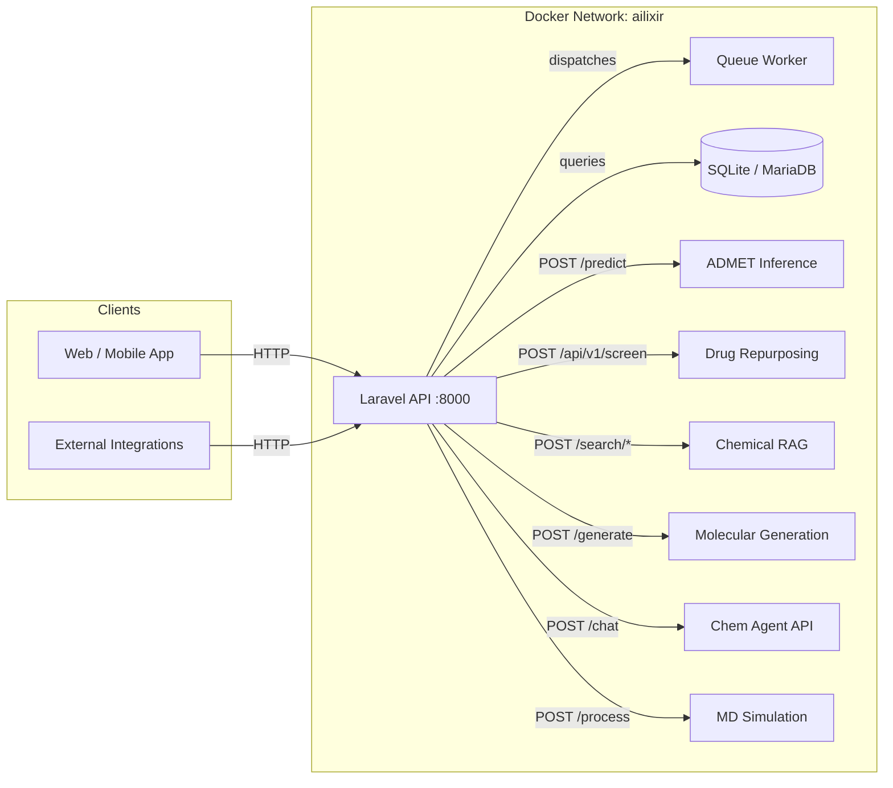
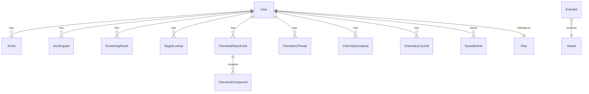

# AILIXIR

AI-powered drug discovery platform that orchestrates molecular generation, virtual screening, ADMET prediction, chemical similarity search, and molecular dynamics simulation through a unified REST API.

---

## Features

- **De Novo Molecular Generation** — REINVENT-based molecule generation with AutoDock-GPU docking scoring
- **Drug Repurposing** — Disease-target identification (OpenTargets), protein sequence retrieval (UniProt), and AI-based virtual screening (DeepPurpose MPNN-CNN)
- **ADMET Prediction** — Multi-task MPNN ensemble predicting Absorption, Distribution, Metabolism, Excretion, and Toxicity from SMILES
- **Chemical Similarity Search** — FAISS binary index with multi-fingerprint fusion (Morgan, MACCS, Atom Pairs, Torsions) and optional Llama-3.1-8B RAG explanations
- **Chemistry AI Agent** — Conversational chemistry assistant with molecule analysis, comparison, and CSV batch processing
- **Molecular Docking** — Vina-based docking with SMILES or PDB input files
- **Protein-Ligand MD Simulation** — Submit and analyze molecular dynamics simulations
- **User Management** — Registration, OTP-based email verification, password reset, Google OAuth
- **Subscription Billing** — Stripe integration via Laravel Cashier with tiered plans (Free, Pro, Max)
- **News Aggregation** — RSS feeds parsed for scientific news with article saving and sharing
- **File Uploads** — Cloudinary integration for molecule images and file storage
- **Hugging Face Spaces** — One-click deployable as a Space with Supervisor-managed processes

---

## Architecture Overview



### Request Lifecycle

1. Client sends an authenticated HTTP request to the Laravel API
2. Laravel validates input, creates a job record, and either:
   - Returns immediately for synchronous AI calls (chemical search, ADMET)
   - Dispatches a background job for long-running pipelines (drug repurposing, docking, generation)
3. The queue worker processes jobs, making HTTP calls to the appropriate AI microservice
4. AI services return predictions; Laravel persists results and status to the database
5. The client polls the job status endpoint or retrieves completed results

---

## Tech Stack

| Category | Technologies |
|---|---|
| **Backend** | Laravel 12 (PHP 8.3), Laravel Sanctum, Laravel Cashier |
| **AI Services** | FastAPI (Python 3.10-3.11), PyTorch, DeepPurpose, RDKit |
| **Database** | SQLite (development), MariaDB (production) |
| **Queue** | Laravel database queue |
| **Search** | FAISS (IndexBinaryFlat, Hamming distance) |
| **LLM** | Llama-3.1-8B-Instruct via HuggingFace Inference API |
| **Molecular Docking** | AutoDock Vina, AutoDock-GPU |
| **Molecular Dynamics** | GROMACS (via Protein-Ligand-MD-Simulation service) |
| **Molecular Generation** | REINVENT, DeepPurpose |
| **Containerization** | Docker, Docker Compose |
| **Web Server** | Nginx, Supervisor |
| **File Storage** | Cloudinary |
| **Payments** | Stripe |
| **CI / CD** | GitHub Actions |
| **Frontend (dev)** | Vite, Tailwind CSS |

---

## Project Structure

```
ailixir-backend/
├── app/
│   ├── Http/Controllers/Api/   # API controllers
│   ├── Jobs/                   # Queue job classes
│   ├── Models/                 # Eloquent models
│   ├── Services/               # Business logic & API clients
│   ├── Traits/                 # Shared traits
│   └── Helpers/                # Utility helpers
├── ai_apps/
│   ├── ADMIT/admet_inference/  # ADMET prediction microservice
│   ├── Drug Reporposing/       # Drug repurposing pipeline
│   ├── chemical-rag-system/    # FAISS + LLM similarity search
│   ├── chem_agent_api/         # Chemistry AI agent
│   ├── generation/             # Molecular generation & docking
│   ├── Protein-Ligand-MD-Simulation/ # MD simulation
│   └── Scientific-Operating-System/  # Scientific AI agent
├── bootstrap/                  # Framework bootstrapping
├── config/                     # Laravel configuration
├── database/                   # Migrations, factories, seeders
├── docker/
│   ├── laravel.env             # Laravel environment template
│   ├── entrypoint.sh           # Docker entrypoint script
│   ├── supervisord.conf        # Supervisor config (HF Spaces)
│   ├── php/opcache.ini         # PHP opcache settings
│   └── nginx/default.conf      # Nginx config
├── resources/                  # Views, frontend assets
├── routes/
│   └── api.php                 # API route definitions
├── storage/                    # Logs, cache, compiled views
├── tests/                      # Pest/PHPUnit tests
├── Dockerfile                  # Multi-stage Docker build
├── docker-compose.yml          # Service orchestration
├── docker-compose.gpu.yml      # GPU-enabled services
└── composer.json               # PHP dependencies
```

---

## Installation

### Prerequisites

- PHP 8.2+
- Composer
- Node.js 22+
- Docker & Docker Compose (recommended)
- Python 3.10+ (for AI services)

### Local Development (Laravel only)

```bash
# Clone and enter the repository
git clone <repo-url> && cd ailixir-backend

# Install PHP dependencies
composer install

# Environment setup
cp .env.example .env
php artisan key:generate

# Database
touch database/ailixir.sqlite
php artisan migrate

# Frontend assets
npm install && npm run build

# Start development servers
composer dev
```

### Full Stack with Docker

```bash
# Build and start all services
docker compose up -d

# Run migrations
docker compose exec laravel php artisan migrate

# Access the API at http://localhost:8080
```

---

## Configuration

### Environment Variables

| Variable | Description | Default |
|---|---|---|
| `APP_KEY` | Laravel application key | auto-generated |
| `APP_ENV` | Environment mode | `production` |
| `APP_DEBUG` | Debug mode | `false` |
| `DB_CONNECTION` | Database driver | `sqlite` |
| `DB_DATABASE` | SQLite path | `/var/www/html/database/ailixir.sqlite` |
| `QUEUE_CONNECTION` | Queue driver | `database` |
| `CACHE_STORE` | Cache driver | `database` |
| `SESSION_DRIVER` | Session driver | `database` |

### AI Service URLs

| Variable | Service | Default |
|---|---|---|
| `CHEMICAL_AI_URL` | Chemical RAG | `http://chemical-rag:5000` |
| `ADMET_AI_URL` | ADMET Inference | `http://admet:8000` |
| `AI_ADMET_SERVICE_URL` | ADMET (alt) | `http://admet:8000` |
| `DRUG_REPURPOSING_URL` | Drug Repurposing | `http://drug-repurposing:8000` |
| `AI_SERVICE_URL` | Drug Repurposing (alt) | `http://drug-repurposing:8000` |
| `GENERATION_SERVICE_URL` | Molecular Generation | `http://generation:8000` |

### External Integrations

| Variable | Service | Required |
|---|---|---|
| `CLOUDINARY_URL` | Cloudinary file storage | For file uploads |
| `CLOUDINARY_CLOUD_NAME` | Cloudinary cloud name | For file uploads |
| `CLOUDINARY_API_KEY` | Cloudinary API key | For file uploads |
| `CLOUDINARY_API_SECRET` | Cloudinary secret | For file uploads |
| `HF_TOKEN` | HuggingFace API token | For LLM explanations |
| `STRIPE_KEY` | Stripe publishable key | For subscriptions |
| `STRIPE_SECRET` | Stripe secret key | For subscriptions |

---

## Running the Project

### Development

```bash
# Laravel + Queue + Vite concurrently
composer dev
```

### Production (Docker)

```bash
docker compose up -d --build
```

### With GPU Acceleration

```bash
docker compose -f docker-compose.yml -f docker-compose.gpu.yml up -d
```

### Hugging Face Spaces

The project includes Supervisor configuration for running on Hugging Face Spaces. Set `RUN_MODE=hf` in the Space secrets.

---

## API Overview

### Authentication

All endpoints except `register`, `login`, and health checks require a Bearer token obtained via `POST /user/login` or `POST /user/register`. Tokens are issued as Laravel Sanctum API tokens.

### Endpoints

| Group | Endpoints | Auth |
|---|---|---|
| **Auth** | `POST /user/register`, `POST /user/login`, `POST /user/logout` | Partial |
| **Email Verification** | `POST /user/verify-email`, `POST /user/resend-verification` | No |
| **Password Reset** | `POST /user/forgot-password`, `POST /user/reset-password` | No |
| **Google OAuth** | `POST /user/auth/google` | No |
| **Profile** | `GET /user/profile`, `POST /user/update-profile` | Sanctum |
| **Drug Repurposing** | `POST /drug-repurposing/targets`, `POST /drug-repurposing/screen`, `GET /drug-repurposing/screen/{id}`, `GET /drug-repurposing/targets/{id}`, history endpoints | Sanctum |
| **Chemical Search** | `POST /chemical-search`, `POST /chemical-search/full-rag` | Sanctum |
| **Chemistry Agent** | `POST /chemistry/chat`, `POST /chemistry/thread`, `POST /chemistry/analyze/smiles`, `POST /chemistry/analyze/compare`, `POST /chemistry/analyze/docking`, `POST /chemistry/csv/upload` | Sanctum |
| **ADMET** | `POST /admet/predict` | Sanctum |
| **Molecular Generation** | `POST /ai/generation/run`, `GET /ai/generation/history`, `GET /ai/generation/status/{job_id}`, `GET /ai/generation/jobs/{job_id}/results` | Sanctum |
| **Molecular Docking** | `POST /docking/submit`, `GET /docking/history`, `GET /docking/{id}`, `GET /docking/download/{id}` | Sanctum |
| **MD Simulation** | `POST /md-simulation/process`, `GET /md-simulation/history`, `GET /md-simulation/status/{jobId}`, `POST /md-simulation/analyze/{jobId}` | Sanctum |
| **SMILES Conversion** | `POST /convert-smiles/convert`, `GET /convert-smiles/history`, `GET /convert-smiles/download/{id}` | Sanctum |
| **News** | `GET /news`, `GET /news/refresh`, `GET /news/categories`, `POST /news/{id}/save`, `GET /news/saved` | Sanctum |
| **Subscriptions** | `GET /plans`, `POST /subscription/checkout`, `GET /subscription/status`, `POST /subscription/swap`, `POST /subscription/cancel`, `POST /subscription/resume`, `GET /subscription/invoices` | Sanctum |
| **AI Integration** | `GET /ai-services/health`, `POST /ai-services/test/admet`, `POST /ai-services/test/chemical-search`, `GET /ai-services/test/drug-repurposing` | When enabled |
| **Scientist / Awards** | `GET /scientists`, `GET /scientists/{id}`, `GET /awards`, `GET /awards/{id}` | Public |

### Request Flow Example

```
POST /user/login  →  { email, password }  →  Bearer token
GET  /user/profile  →  Authorization: Bearer <token>  →  user data
POST /drug-repurposing/screen  →  { disease_name, top_n_targets }  →  job_id
GET  /drug-repurposing/screen/{id}  →  { status, output }
```

---

## AI Pipeline

### Drug Repurposing Pipeline

```
Input: disease_name + optional parameters
  │
  ├── 1. Disease Target Mapping (OpenTargets API)
  │     Identifies protein targets associated with the disease
  │
  ├── 2. Protein Sequence Retrieval (UniProt API)
  │     Fetches amino acid sequences for identified targets
  │
  ├── 3. Drug Library Loading (TDC / fallback)
  │     Loads FDA-approved drugs with SMILES notation
  │
  ├── 4. AI Virtual Screening (DeepPurpose MPNN-CNN)
  │     Predicts drug-target binding affinities
  │
  └── 5. Result Processing
        Ranks candidates, marks known vs. novel treatments
  │
Output: ranked list of drug-target pairs with affinity scores
```

### ADMET Prediction Pipeline

```
Input: SMILES string
  │
  ├── 1. SMILES Validation (RDKit)
  │     Validates and canonicalizes the input
  │
  ├── 2. Molecular Featurization
  │     Converts to molecular graph (SimpleMoleculeMolGraph)
  │
  ├── 3. Parallel MPNN Inference (5 models)
  │     Absorption · Distribution · Metabolism · Excretion · Toxicity
  │
  └── 4. Aggregation
  │
Output: { Absorption: 0.75, Distribution: 0.82, Metabolism: 0.68, ... }
```

### Chemical RAG Pipeline

```
Input: SMILES + top_k
  │
  ├── 1. Morgan Fingerprint (2048-bit binary)
  │     Converts SMILES to binary fingerprint
  │
  ├── 2. FAISS Binary Retrieval (IndexBinaryFlat)
  │     Hamming-distance search, top 200 candidates
  │
  ├── 3. Multi-Fingerprint Fusion
  │     Morgan · MACCS · Atom Pairs · Topological Torsions (weighted)
  │
  ├── 4. Chemical-Aware Reranking
  │     Aromaticity bonus · Ring-system bonus · Charge penalty · Fragment penalty
  │
  ├── 5. Z-Score Calibration → Sigmoid Probability [0, 1]
  │
  ├── 6. MMR Diversity Selection (λ=0.6)
  │
  └── 7. [Optional] LLM Explanation (Llama-3.1-8B)
  │
Output: ranked similar compounds with similarity scores and optional explanations
```

### Molecular Generation Pipeline

```
Input: preset (e.g. egfr_generator) + num_molecules
  │
  ├── 1. REINVENT Molecule Generation
  │     Generates novel molecules with desired properties
  │
  ├── 2. RDKit Validation + SA Score Calculation
  │
  ├── 3. [Optional] DeepPurpose Affinity Prediction
  │
  └── 4. [Optional] AutoDock-GPU Docking
  │
Output: SMILES strings, affinity scores, docked poses
```

---

## Database Design

### Models Overview

| Model | Table | Description |
|---|---|---|
| `User` | `users` | Registered users with OTP fields, plan, and Stripe integration |
| `Plan` | `plans` | Subscription plan definitions (free, pro, max) |
| `AiJob` | `ai_jobs` | Molecular generation job tracking (status, stage, files, ligands) |
| `DockingJob` | `docking_jobs` | Docking job records (input_type, SMILES, protein, scores) |
| `ScreeningResult` | `screening_results` | Drug repurposing screening results (input, output, status) |
| `TargetLookup` | `target_lookups` | Disease target lookup records |
| `ChemicalSearchJob` | `chemical_search_jobs` | Chemical similarity search history |
| `ChemicalCompound` | `chemical_compounds` | Individual compound results linked to search jobs |
| `ChemistryThread` | `chemistry_threads` | AI chemistry agent conversation threads |
| `ChemistryAnalysis` | `chemistry_analyses` | Molecule analysis records |
| `ChemistryCsvJob` | `chemistry_csv_jobs` | CSV batch processing jobs |
| `MdSimulationJob` | `md_simulation_jobs` | MD simulation job metadata |
| `Admet` | `admets` | ADMET prediction records |
| `NewsArticle` | `news_articles` | Cached RSS news articles |
| `SavedArticle` | `saved_articles` | User-saved articles |
| `Scientist` / `Award` | `scientists` / `awards` | Public directory data |

### Key Relationships



---

## Example Workflow

### End-to-End Drug Repurposing Screening

```bash
# 1. Register a new user
curl -X POST http://localhost:8080/user/register \
  -H "Content-Type: application/json" \
  -d '{"name":"Researcher","email":"r@example.com","password":"secret123"}'

# 2. Login to obtain a token
TOKEN=$(curl -s -X POST http://localhost:8080/user/login \
  -H "Content-Type: application/json" \
  -d '{"email":"r@example.com","password":"secret123"}' \
  | jq -r '.data.token')

# 3. Submit a drug repurposing screening job
JOB_ID=$(curl -s -X POST http://localhost:8080/drug-repurposing/screen \
  -H "Authorization: Bearer $TOKEN" \
  -H "Content-Type: application/json" \
  -d '{"disease_name":"Type 2 Diabetes","top_n_targets":10}' \
  | jq -r '.data.job_id')

# 4. Poll for results
curl -s -X GET "http://localhost:8080/drug-repurposing/screen/$JOB_ID" \
  -H "Authorization: Bearer $TOKEN" | jq '.data.status'

# 5. Check ADMET properties of a candidate drug
curl -s -X POST http://localhost:8080/admet/predict \
  -H "Authorization: Bearer $TOKEN" \
  -H "Content-Type: application/json" \
  -d '{"smiles":"CC(=O)Oc1ccccc1C(=O)O"}' | jq '.data.predictions'
```

---

## Screenshots

> Diagrams and screenshots are located in the `Diagrams/` directory. They include architecture diagrams, sequence diagrams, and state diagrams for the drug repurposing, docking, and authentication workflows.

---

## Performance Notes

### Caching
- AI service URLs are read from config (cached by Laravel)
- Laravel config and route caching enabled in production
- Compiled views and optimized autoloader in Docker build

### Concurrency
- Laravel queue workers process jobs sequentially per worker (horizontal scaling via multiple workers)
- ADMET inference uses `asyncio` for parallel model inference across 5 MPNN models
- Chemical RAG uses FAISS IVF for sub-millisecond binary search
- Chat agent and generation services are synchronous per request

### Scalability
- AI services are stateless and can be horizontally replicated behind a load balancer
- Database-backed queue for job durability
- FAISS index persisted to disk volume for fast reload
- Resource limits configurable per service in `docker-compose.yml`

### Known Bottlenecks
- DeepPurpose model loading requires 4-8 GB RAM per instance
- AutoDock-GPU docking is compute-intensive (minutes per molecule on CPU)
- REINVENT generation coupled with DeepPurpose prediction for filtering
- First-time Chemical RAG startup performs full compound ingestion and index build (~1M+ compounds)

---

## Future Improvements

- **GPU Acceleration** — Full GPU support for AutoDock-GPU, REINVENT, and DeepPurpose across all AI services
- **Distributed Queue** — Replace database queue with Redis for higher throughput
- **Model Registry** — Versioned model storage with A/B testing support
- **Result Caching** — Redis-based caching for identical SMILES queries to ADMET and search endpoints
- **WebSocket Notifications** — Real-time job status updates via Laravel WebSockets
- **Multi-Tenant Organizations** — Team-based collaboration with shared job history
- **Expanded ADMET Models** — Additional endpoints for CYP450 isoform-specific predictions
- **Automated Retraining** — Feedback loop for continuous model improvement from user-validated results

---

## Contributing

1. Fork the repository
2. Create a feature branch (`git checkout -b feature/my-feature`)
3. Make your changes
4. Run the test suite (`composer test`)
5. Submit a pull request

### Development Guidelines

- Follow PSR-12 coding standards
- Use Laravel Pint for code style (`./vendor/bin/pint`)
- Add Pest tests for new functionality
- Document new API endpoints in the route definitions

---

## License

MIT
